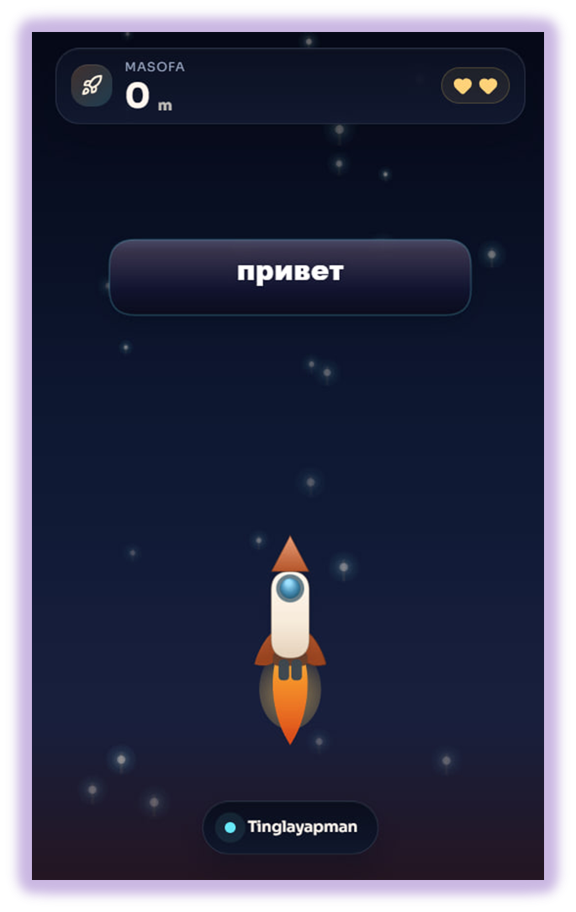
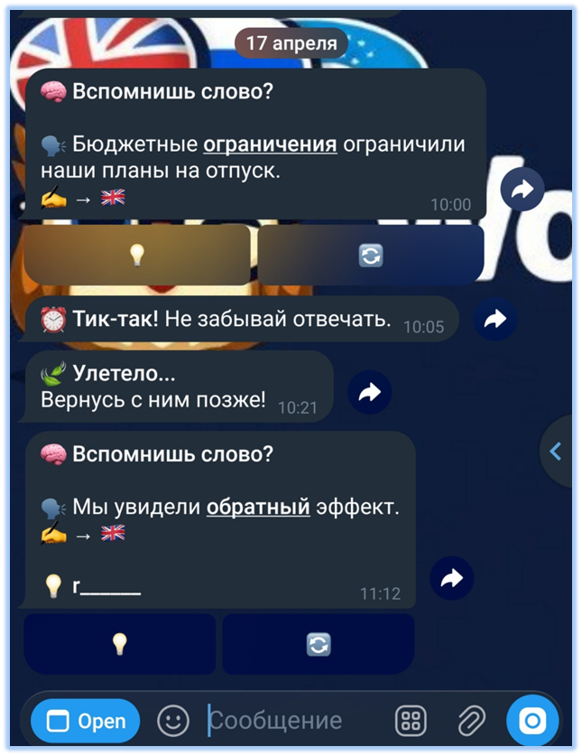
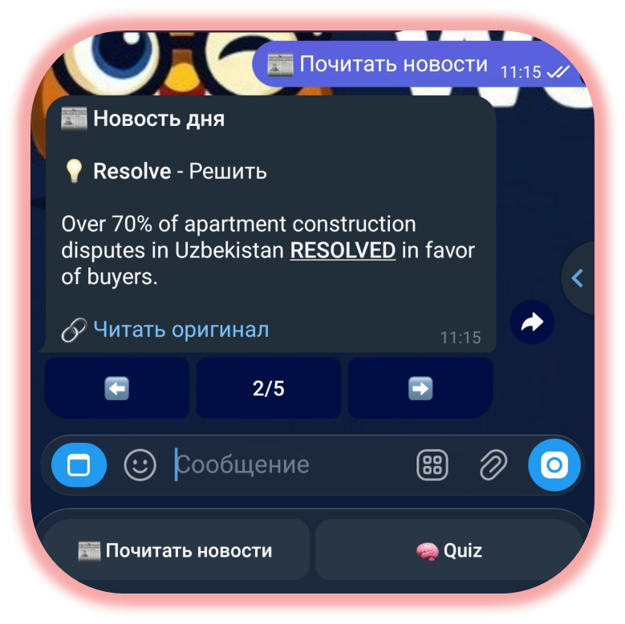

# 🚀 WordPing

<p align="center">
  <strong>Learn English vocabulary inside Telegram with spaced repetition, quick quizzes, reminders, and real-world news examples.</strong>
</p>

<p align="center">
  
  
  
  
  
</p>

<p align="center">
  <a href="#-screenshots">Screenshots</a> •
  <a href="#-looking-for-contributors">Contribute</a> •
  <a href="#-features">Features</a> •
  <a href="#-quick-start">Quick Start</a> •
  <a href="#-tests">Tests</a>
</p>

WordPing is a Telegram bot and Telegram Mini App for learning English vocabulary with spaced repetition, short quizzes, reminders, and contextual examples from the news.

The backend runs a Telegram bot, an Express API, Prisma/Postgres persistence, and scheduled workers. The frontend is a React + Vite Mini App in `web/`.

> 🧠 **Tiny daily practice, serious retention.** WordPing keeps vocabulary reviews close to the place where users already chat: Telegram.

## 📸 Screenshots

| Mini App practice | Telegram review reminder | News vocabulary card |
| --- | --- | --- |
|  |  |  |

## 🤝 Looking For Contributors

WordPing is ready for contributors who enjoy language-learning tools, Telegram bots, TypeScript services, test coverage, UX polish, and practical open-source maintenance.

Good first areas include:

- improving onboarding and docs;
- adding more screenshots and Mini App walkthroughs;
- expanding bot, worker, API, and frontend tests;
- reviewing CI, deployment, and security posture;
- polishing the Telegram Mini App user experience.

See [CONTRIBUTING.md](CONTRIBUTING.md) and the open GitHub issues for suggested starting points.

## ✨ Features

- Add words through `/add` with language detection and fallback auto-translation.
- Store two cards for each word: `EN -> native` and `native -> EN`.
- Review words through a fixed SRS ladder: `5 min -> 25 min -> 1.5 h -> 20 h -> 2.5 d -> 6 d -> 14 d -> 30 d`.
- Grade reviews as `Hard`, `Good`, or `Easy` to move cards backward, forward, or two stages forward.
- Receive reminders with `+5 min`, `+20 min`, and later `1 hour` retry behavior.
- Practice quiz sessions with multiple choice, true/false, and context questions.
- Read prepared news vocabulary cards without calling external news providers from the main bot flow.
- Open settings and statistics in the Telegram Mini App when `WEBAPP_URL` is configured.

## 🧩 Architecture

- `src/bot` - Telegram bot flows, callback payloads, quiz/settings/news digest UI, and runtime logic.
- `src/api` - Express API for the Mini App and health/readiness endpoints.
- `src/scheduler/worker.ts` - main review/reminder worker.
- `src/scheduler/newsWorker.ts` - news-only worker for RSS/news resolution.
- `src/services` - SRS, quiz, translation, sessions, users, and news pipeline services.
- `src/utils` - shared helpers for environment parsing, logging, runtime health, time, and text handling.
- `prisma` - Prisma schema and migrations.
- `tests` - Vitest coverage for bot, API, services, workers, news, backup, and release flows.
- `web` - React/Vite Telegram Mini App.
- `scripts` - backup, restore, deploy, migration, and rollback scripts.

Production runs four processes: `api`, `bot`, `worker`, and `news-worker`.

## ⚡ Quick Start

Requirements:

- Node.js
- PostgreSQL

Install dependencies and prepare Prisma:

```bash
npm install
cp .env.example .env
npx prisma generate
npx prisma migrate deploy
```

At minimum, configure:

- `BOT_TOKEN` - Telegram bot token from BotFather.
- `DATABASE_URL` - PostgreSQL connection string.

Run locally:

```bash
npm run dev:api
npm run dev:bot
npm run dev:worker
npm run dev:news-worker
npm run dev:web
```

Production with PM2:

```bash
npm i -g pm2
npm run build
npm run pm2:start
```

## 📱 Mini App And API

Frontend environment variables live in `web/.env`; backend environment variables live in the root `.env`.

Useful variables:

- `BOT_USERNAME` - used for `t.me/<bot>/app` links.
- `VITE_BOT_USERNAME` - used by the Mini App for referral links.
- `VITE_ADMIN_TELEGRAM_ID` - optional admin tab visibility.
- `WEBAPP_URL` - Mini App URL sent by the bot.
- `WEB_ORIGIN` - production origin for the API.
- `ALLOW_DEV_AUTH=true` - local development without Telegram init data.

In local development, open the Mini App with:

```text
?devUserId=123456789
```

Mini App authorization uses:

- `x-telegram-init-data` - Telegram WebApp context.
- `x-dev-user-id` - local development mode.

Keep `ALLOW_DEV_AUTH=false` in production.

If the frontend and API are on the same AWS server, configure a reverse proxy:

```text
https://your-domain/api/* -> http://127.0.0.1:3001/api/*
```

Production Mini App static files are served by nginx from `/var/www/wordping`. After `npm run build:web`, sync `web/dist/` to `/var/www/wordping/` and reload nginx.

## 🧠 Learning And Quiz Logic

Early stages ask for a simple translation. Starting at `stage >= 2`, WordPing uses contextual examples generated through the Gemini API.

- `Stage 0-1`: isolated translation.
- `Stage 2-6`: the word is highlighted inside a sentence.
- `Stage 7+`: the word is replaced with `___`.
- Each word can store multiple examples so users do not memorize a single sentence.
- The main `worker` fills missing examples in the background.

Quiz sessions are short runs of `10` questions. They include words with `stage >= 2` and prioritize recent mistakes, `hardStreak`, overdue reviews, and stale examples.

## 📰 News Pipeline

The `Read news` flow shows prepared examples from the database. The bot does not call external news APIs when a user taps the news button.

News pipeline:

1. Words with `stage >= 4` are enqueued as `NewsResolveJob` records.
2. `news-worker` resolves examples through RSS cache, NewsData.io, GDELT, and The Guardian.
3. Prepared cards are served in batches of 5.
4. Source links are checked; `404/410` responses are marked for refresh.

Important rule: `src/scheduler/worker.ts` must not call external news providers directly. External news API calls belong only in `src/scheduler/newsWorker.ts` and `src/services/news*`.

## ⏰ Time And Storage

- Database timestamps are stored in UTC.
- User notification windows are stored as minutes from `00:00`, defaulting to `08:00-23:00`.
- Notification checks use the user's timezone. If a timezone is not configured, UTC is used.

## 🛠️ Useful Commands

```bash
npm run migrate:dev
npm run migrate:deploy
npm run prisma:generate
npm run dev:news-worker
npm run start:news-worker
npm run pm2:start
npm run pm2:restart
npm run pm2:stop
npm run pm2:delete
npm run pm2:logs
npm run backup:db
npm run restore:db -- ./backups/postgres/<file>.dump
```

Example production path:

```bash
~/apps/WordPing
```

## 🚢 Deploy And Backup

The current production flow is documented in [DEPLOY.md](DEPLOY.md).

Deploy:

```bash
cd ~/apps/WordPing
./scripts/deploy-prod.sh origin/main
```

If Prisma migrations are present, run the migration flow from [DEPLOY.md](DEPLOY.md) before the application deploy.

Backups use `pg_dump` in `.dump` format, are stored in `./backups/postgres`, and are sent to the administrator through Telegram. Restore uses `pg_restore`.

Manual backup:

```bash
npm run backup:db
```

Restore:

```bash
npm run restore:db -- ./backups/postgres/<file>.dump
```

Nightly cron:

```bash
0 3 * * * cd ~/apps/WordPing && /usr/bin/npm run backup:db >> ~/apps/WordPing/backups/backup.log 2>&1
```

## 🔐 Environment

Core runtime variables:

- `BOT_TOKEN`
- `DATABASE_URL`
- `ADMIN_TELEGRAM_ID`
- `WEBAPP_URL`
- `ALLOW_DEV_AUTH=false` in production

Translation:

- `GEMINI_API_KEY`
- `GEMINI_MODEL=gemini-2.5-flash-lite`
- `GEMINI_FALLBACK_MODELS=gemini-2.5-flash,gemini-2.0-flash-lite`
- `HF_API_KEY`
- `HF_INFERENCE_BASE_URL`
- `TRANSLATE_API_URL=https://api.mymemory.translated.net/get`
- `DAILY_AUTO_TRANSLATE_LIMIT=30`

News:

- `NEWS_RSS_FEEDS`
- `NEWS_RSS_PRIMARY_DOMAINS`
- `NEWSDATA_API_KEY`
- `GDELT_API_URL`
- `GUARDIAN_API_KEY`
- `NEWS_*` cron, retry, timeout, and retention settings

Backup:

- `BACKUP_DIR`
- `BACKUP_FILE_PREFIX`
- `BACKUP_RETENTION_COUNT`
- `TELEGRAM_BOT_API_BASE_URL`
- `TELEGRAM_MAX_UPLOAD_MB`
- `PG_DUMP_BIN`
- `PG_RESTORE_BIN`

See [.env.example](.env.example) for the complete list.

## 🩺 Logs And Healthcheck

Logs are written to `stdout`/`stderr`.

- Local default format: `pretty`.
- Production through PM2: `json`.
- `LOG_LEVEL`: `debug`, `info`, `warn`, `error`.
- `LOG_FORMAT`: `pretty`, `json`.
- The API includes `x-request-id` in request logs.

Healthcheck:

```http
GET /api/health
```

The endpoint returns API, database, and backend process heartbeat status.

## ✅ Tests

```bash
npm test
```

Integration tests use PostgreSQL and, by default, create a `test` schema in the database from `DATABASE_URL`. Set `TEST_DATABASE_URL` when a separate test database is needed.

Before handing off most code changes, run:

```bash
npm run lint
npm test
npm run build
```

When `web/` changes, also run:

```bash
npm run build:web
```

## 📄 License

WordPing is released under the [MIT License](LICENSE).
